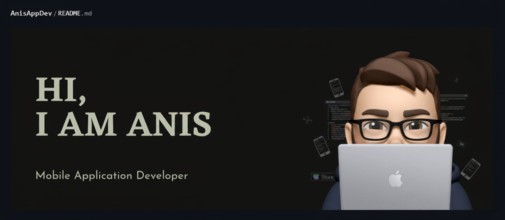

# Hi there, I'm Kaida Anis 👋  

🎓 **B.C.A. Student @ Atmiya University, Rajkot** (Completed)  
💻 Passionate about **App Development & Software Engineering**  
📍 Rajkot, Gujarat, India  

---

## 🚀 About Me  
- 🌱 Currently building my expertise in **Android Development (Java & Kotlin)**  
- 🔜 Next step: Exploring **Flutter** for cross-platform mobile apps  
- 💡 Strong interest in **mobile apps, databases, and backend integration**  
- 🤝 Open to **collaborations** on Android, Flutter, and Web Tech projects  
- 🎯 Goal: To grow as a **skilled software developer** and contribute to impactful digital solutions  

---

## 🛠️ Skills  
- **Programming:** C, C++, Java, Python (basic)  
- **Database:** MySQL (basic understanding)  
- **App Development:** Android Studio (Java & Kotlin), Flutter (upcoming)  
- **Web:** PHP basics  
- **Tools:** Git, VS Code  

---

## 📂 Projects  
- 📌 **Expenses Management System** (PHP) – Sem 4  
- 📌 **Food Ordering App** (Android: Java) – Sem 6  

---

## 🎖️ Internship Experience  
- 🌍 **Social Internship** – Atmiya University , Rajkot 
- 🏢 **Domain Internship** – Festival Post, Rajkot  

---

## 📊 Education  
- **B.C.A.** – Atmiya University, Rajkot  
  - 6th Semester (2025) | CGPA: **9.06** | Percentage: **90%**  

---

## 🌐 Connect with Me  

  
  

---

⭐️ From [Kaida Anis](https://github.com/your-username)
